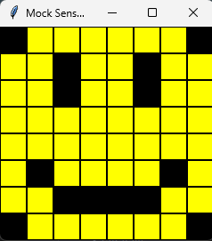
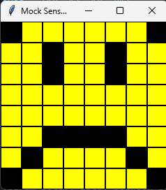

# Evidence and Knowledge

This document includes instructions and knowledge questions that must be completed to receive a *Competent* grade on this portfolio task.

## 1. Required evidence

### 1.1. Answer all questions in this document

- Each answer should be complete, well-articulated, and within the specified word count limits (if added) for each question.
- Please make sure **all** external sources are properly cited.
- You must **use your own words**. Please include your full chat transcripts if you use generative AI in any way.
- Generative AI hallucinates, is not an authoritative source

### 1.2. Make all the required modifications to the code

- Please follow the instructions in this document to make the changes needed to the code.

- When requested to upload evidence, upload all screenshots to `screenshots/` and embed them in this document. For example:

```markdown

```


> Note the `!`, and the use of a relative path.

- You must upload the code into your GitHub repository.
- While you can use a branch, your code should be in main when you submit.
- Upload a zip of this repository to Blackboard when you are ready to submit.
- You will be notified of your result via Blackboard
- However, if using GitHub classrooms, you may also receive additional feedback on GitHub directly

### 1.3. Optional: Use of Raspberry Pi and SenseHat

Raspberry Pi or SenseHat is **optional** for this activity. You can use the included `sense_hat.py` file to simulate the SenseHat on your computer.

If you use a Pi, please **delete** the `sense_hat.py` file.

### 1.4. Accessible version of the code

This project relies on visual patterns that appear on an LED matrix. If you have any accessibility requirements, you can use the `udl/accessible` branch to complete the project. This branch provides an accessible code version that uses text-based patterns instead of visual ones.

Please discuss this with your lecturer before using that branch.

## 2. Specific Tasks & Questions

Address the following tasks and questions based on the code provided in this repository.

### 2.1. Set up the project locally

1. Fork this repository (if not using GitHub Classrooms)
2. Clone your repository locally
3. Run the project locally by executing the `main.py` file
4. Evidence this by providing screenshots of the project directory structure and the output of the `main.py` file

~~~~

If you are running on a Raspberry Pi, you can use the following command to run the project and then screenshot the result:

```bash
ls
python3 main.py
```

### 2.2. Fundamental code comprehension

 Answer each of the following questions **as they relate to that code** supplied by in this repository (ignore `sense_hat.py`):

1. Examine the code for the `smiley.py` file and provide  an example of a variable of each of the following types and their corresponding values (`_` should be replaced with the appropriate values):

   | Type                    | name   | value |
   | ----------              |--------|-------|
   | built-in primitive type | dimmed    | True      |
   | built-in composite type | WHITE  | (255, 255, 255) |
   | user-defined type       | sense_hat | SenseHat() |

2. Fill in (`_`) the following table based on the code in `smiley.py`:

   | Object                   | Type   |
   | ------------             |--------|
   | self.pixels              | list   |
   | A member of self.pixels  | tuple  |
   | self                     | Smiley |

3. Examine the code for `smiley.py`, `sad.py`, and `happy.py`. Give an example of each of the following control structures using an example from **each** of these files. Include the first line and the line range:

   | Control Flow | File      | First line | Line range        |
   | ------------ |-----------|------------|-------------------|
   |  sequence    | smiley.py | 13         | 13-26 (inclusive) |
   |  selection   | happy.py  | 31         | 31-31             |
   |  iteration   | sad.py    | 25         | 25-30 (inclusive) |

4. Though everything in Python is an object, it is sometimes said to have four "primitive" types. Examining the three files `smiley.py`, `sad.py`, and `happy.py`, identify which of the following types are used in any of these files, and give an example of each (use an example from the code, if applicable, otherwise provide an example of your own):

   | Type                    | Used?               | Example                              |
   | ----------------------- |---------------------|--------------------------------------|
   | int                     | Yes inside the list | mouth = [41, 46, 50, 51, 52, 53]     |
   | float                   | Yes                 | def blink(self, delay=0.25):         |
   | str                     | No                  | name = "John"                        |
   | bool                    | Yes                 | def draw_eyes(self, wide_open=True): |

5. Examining `smiley.py`, provide an example of a class variable and an instance variable (attribute). Explain **why** one is defined as a class variable and the other as an instance variable.

> self.sense_hat is an instance var the reason for this is each Smiley needs its own SenseHat instance.
> 
> WHITE is a class var the reason for this is that it remains const and therefore isn't changed per instance so there is no need for each instance to have its own version.
>

6. Examine `happy.py`, and identify the constructor (initializer) for the `Happy` class:
   1. What is the purpose of a constructor (in general) and this one (in particular)?

   > The purpose in general is to setup the class for use and for this one it is to draw the happy face.
   >

   2. What statement(s) does it execute (consider the `super` call), and what is the result?

   > These 3 
        
        super().__init__() - Calls the parent (Smiley’s) __init__() method

        self.draw_mouth() - Draws a mouth.
        self.draw_eyes() - Draws the eyes open.


### 2.3. Code style

1. What code style is used in the code? Is it likely to be the same as the code style used in the SenseHat? Give to reasons as to why/why not:

> PEP 8, yes because SenseHat is an official python library which means it follow standard python practices which includes PEP 8.
>

2. List three aspects of this convention you see applied in the code.

> Function names are in lowercase using and use underscores where applicable.
> 
> Docstrings are writen in triple quotes.
> 
> Theres 1 blank line between methods.
>

3. Give two examples of organizational documentation in the code.
>  
        """
       Draws the eyes (open or closed) on the standard smiley.
        :param wide_open (bool): eyes open or closed.
        """

        """
       Renders a mouth by blanking the pixels that form that object.
        """
>

### 2.4. Identifying and understanding classes

> Note: Ignore the `sense_hat.py` file when answering the questions below

1. List all the classes you identified in the project. Indicate which classes are base classes and which are subclasses. For subclasses, identify all direct base classes.
  
  Use the following table for your answers:

| Class Name | Super or Sub? | Direct parent(s)  |
|------------|---------------|-------------------|
| Blinkable  | Sub & Super   | ABC               |
| Happy      | Sub           | Smiley, Blinkable |
| Sad        | Sub           | Smiley            |
| Smiley     | Super         |                   |

2. Explain the concept of abstraction, giving an example from the project (note "implementing an ABC" is **not** in itself an example of abstraction). (Max 150 words)

> Abstraction is the process of hiding complex implementation details and only exposing what is necessary. For example when you call blink on a blinkable class you don't have to be concerned with how that class performs the blink. 
>

3. What is the name of the process of deriving from base classes? What is its purpose in this project? (Max 150 words)

> Your base class should provide some sort of base or extensible framework that you intend to extend or implement the behaviour of in a child class. For example the blinkable class defines a bink method that is overridden in children, so you can be sure that if a class inherits from blinkable then it can blink.
>

### 2.5. Compare and contrast classes

Compare and contrast the classes Happy and Sad.

1. What is the key difference between the two classes?
   > Sad does not derive from the blinkable class.
   >
2. What are the key similarities?
   > They both draw a mouth and eyes.
   >
3. What difference stands out the most to you and why?
   > That Sad cannot blink because it doesn't have a blink method, and it does not inherit from the blinkable class.
   >
4. How does this difference affect the functionality of these classes
   > Sad cannot blink because it does not have that functionality implemented to blink and doesnt inherit from blinkable.
   >

### 2.6. Where is the Sense(Hat) in the code?

1. Which class(es) utilize the functionality of the SenseHat?
   > Smiley and its children.
   >
2. Which of these classes directly interact with the SenseHat functionalities?
   > Smiley
   >
3. Discuss the hiding of the SenseHAT in terms of encapsulation (100-200 Words)
   > Sense Hat is a good example of encapsulation it hides all of its inner workings from the user, like managing a GUI, process queue and managing a LED matrix. Users dont need to know how the class works they just interact with a simple interface like set_pixels method or the low_light property and it just works. This encapsulation also ensures that external factors won't accidently interfere with Sense Hat classes internal functionality or state. Encapsulation also improves maintainability and flexibility of a class whether the program interacts with this mock or real Sense Hat class the external interface remains the so the program runs as normal with either or.
   >

### 2.7. Sad Smileys Can’t Blink (Or Can They?)

Unlike the `Happy` smiley, the current implementation of the `Sad` smiley does not possess the ability to blink. Let's first explore how blinking has been implemented in the Happy Smiley by examining the blink() method, which takes one argument that determines the duration of the blink.

**Understanding Blink Mechanism:**

1. Does the code's author believe that every `Smiley` should be able to blink? Explain.

> No because if they did there would be a blink method in the Smiley class.
>

2. For those smileys that blink, does the author expect them to blink in the same way? Explain.

> No inheriting from the blink class just means it can blink it does not mean they the blink the exact same. The way they blink is up to each class that inherits from blinkable to decide.
>

3. Referring to the implementation of blink in the Happy and Sad Smiley classes, give a brief explanation of what polymorphism is.

> Polymorphism is the ability for inherting classes to be treated through the same interface even though there internals may be different for example code can call the blink method on any blinkable without knowing the exact subclass. 
>

4. How is inheritance used in the blink method, and why is it important for polymorphism?

> Inheritance allows the happy class to inherit from blinkable which means it inherits the blink method which is abstract in this case which forces a implementation in any derived classes of blinkable. Which is important for polymorphism because it guarantees that any class that inherits from blinkable will be able to blink.
>
1. **Implement Blink in Sad Class:**

   - Create a new method called `blink` within the Sad class. Ensure you use the same method signature as in the Happy class:

   ```python
   def blink(self, delay=0.25):
       pass  # Replace 'pass' with your implementation
   ```

2. **Code Implementation:** Implement the code that allows the Sad smiley to blink. Use the implementation from the Happy Smiley as a reference. Ensure your new method functions similarly by controlling the blink duration through the `delay` argument.

3. **Testing the Implementation:**

- Test the new blink functionality on your Raspberry Pi or within the Python classes provided. You might need to adjust the `main.py` script to incorporate Sad Smiley's new blinking capability.

Include a screenshot of the sad smiley or the modified `main.py`:


   

- Observe and document the Sad smiley as it blinks its eyes. Describe any adjustments or issues encountered during implementation.

  > An adjustment i had to do was change the Happy() to a Sad() in the main.py file so it would use my Sad class instead. Only issue i encountered was for a missing import from sad import Sad

  ### 2.8. If It Walks Like a Duck…

  Previously, you implemented the blink functionality for the Sad smiley without utilizing the class `Blinkable`. Assuming you did not use `Blinkable` (even if you actually did), consider how the Sad smiley could blink similarly to the Happy smiley without this specific class.

  1. **Class Type Analysis:** What kind of class is `Blinkable`? Inspect its superclass for clues about its classification.

     > It is an abstract class.

  2. **Class Implementation:** `Blinkable` is a class intended to be implemented by other classes. What generic term describes this kind of class, which is designed for implementation by others? **Clue**: Notice the lack of any concrete implementation and the naming convention.

  > Abstract.

  3. **OO Principle Identification:** Regarding your answer to question (2), which Object-Oriented (OO) principle does this represent? Choose from the following and justify your answer in 1-2 sentences: Abstraction, Polymorphism, Inheritance, Encapsulation.

  > This is abstraction because the Blinkable class just defines a general interface. Other classes can just interact Blinkables defined methods without caring about the implementation.

  4. **Implementation Flexibility:** Explain why you could grant the Sad Smiley a blinking feature similar to the Happy Smiley's implementation, even without directly using `Blinkable`.

  > You dont need to inherit from blinkable to make it blink if you inherit from blinkable you must be able to blink thats why its there so someone could look at the class and say oh it inherits from blinkable it must be able to blink but you dont need the blinkable class to be able to blink you can just add the method and call it.

  5. **Concept and Language Specificity:** In relation to your response to question (4), what is this capability known as, and why is it feasible in Python and many other dynamically typed languages but not in most statically typed programming languages like C#? **Clue** This concept is hinted at in the title of this section.

  > I assume your talking about Duck typing while i didn't use duck typing for my implementation of blink. Python can do this because it is a dynamically typed language so method availability is checked at runtime instead of compile time. In statically typed languages method availability is enforced at compile time.

  ***

  ## 3. Refactoring

  ### 3.1. Does a Smiley Have to Be Yellow?

  While our current implementation predominantly features yellow smileys, emotional expressions like sickness or anger typically utilize colors like green, red, or orange. We'll explore the feasibility of integrating these colors into our smileys.

  1. **Defined Colors and Their Location:**

     1. Which colors are defined and in which class(s)?
        > White, Green, Red, Yellow, Blank
     2. What type of variables hold these colors? Are the values expected to change during the program's execution? Explain your answer.
        > Const variables and no they are not hence they are const.
     3. Add the color blue to the appropriate class using the appropriate format and values.
        > BLUE = (0, 0, 255)

  2. **Usage of Color Variables:**

     1. In which classes are the color variables used?
        > Smiley, Happy and Sad.

  3. **Simple Method to Change Colors:**
  4. What is the easiest way you can think to change the smileys to green? Easiest, not necessarily the best!
     > Go into every class that uses YELLOW and change it to GREEN.


  ### 3.2. Flexible Colors – Step 1

  Changing the color of the smileys once is straightforward, but it isn't very flexible. To facilitate various colors for smileys, it is advisable not to hardcode values in any class. This approach was identified earlier as a necessary change. Let's start by removing the built-in assumptions about color in our classes.

  1. **Add a method called `complexion` to the `Smiley` class:** Implement this instance method to return `self.YELLOW`. Using the term "complexion" instead of "color" provides a more abstract terminology that focuses on the meaning rather than implementation.

  2. **Refactor subclasses to use the `complexion` method:** Modify any subclass that directly accesses the color variable to instead utilize the new `complexion` method. This ensures that color handling is centralized and can be easily modified in the future.

  3. **Determine the applicable Object-Oriented principle:** Consider whether Abstraction, Polymorphism, Inheritance, or Encapsulation best applies to the modifications made in this step.

  4. **Verify the implementation:** Ensure that the modifications function as expected. The smileys should still display in yellow, confirming that the new method correctly replaces the direct color references.

  This step is crucial for setting up a more flexible system for color management in the smiley display logic, allowing for easy adjustments and extensions in the future.

  ### 3.3. Flexible Colors – Step 2

  Having removed the hardcoded color values, we now enhance the base class to support dynamic color assignments more effectively.

  1. **Modify the `__init__()` method in the `Smiley` class:** Introduce a default argument named `complexion` and assign `YELLOW` as its default value. This allows the instantiation of smileys with customizable colors.

  2. **Introduce a new instance variable:** Create a variable called `my_complexion` and assign the `complexion` parameter to it. This step ensures that each smiley instance can maintain its own color state.

  3. **Rationale for `my_complexion`:** Using a distinct instance variable like `my_complexion` avoids potential conflicts with the method parameter names and clarifies that it is an attribute specific to the object.

  4. **Bulk rename:** We want to update our grid to use the value of complexion, but we have so many `Y`'s in the grid. Use your IDE's refactoring tool to rename all instances of the **symbol** `Y` to `X`. Where `X` is the value of the `complexion` variable. Include a screenshot evidencing you have found the correct refactor tool and the changes made.

  

  5. **Update the `complexion` method:** Adjust this method to return `self.my_complexion`, ensuring that whatever color is assigned during instantiation is what the smiley displays.

  6. **Verification:** Run the updated code to confirm that Smileys still defaults to yellow unless specified otherwise.

  ### 3.4. Flexible Colors – Step 3

  With the foundational changes in place, it's now possible to implement varied smiley colors for different emotional expressions.

  1. **Adjust the `Sad` class initialization:** In the `Sad` class's initializer method, change the superclass call to include the `complexion` argument with the value `self.BLUE`, as shown:

     ```python
     super().__init__(complexion=self.BLUE)
     ```

  2. **Test color functionality for the Sad smiley:** Execute the program to verify that the Sad smiley now appears blue.

  3. **Ensure the Happy smiley remains yellow:** Confirm that changes to the Sad smiley do not affect the default color of the Happy smiley, which should still display in yellow.

  4. **Design and Implement An Angry Smiley:** Create an Angry smiley class that inherits from the `Smiley` class. Set the color of the Angry smiley to red by passing `self.RED` as the `complexion` argument in the superclass call.

  ***
